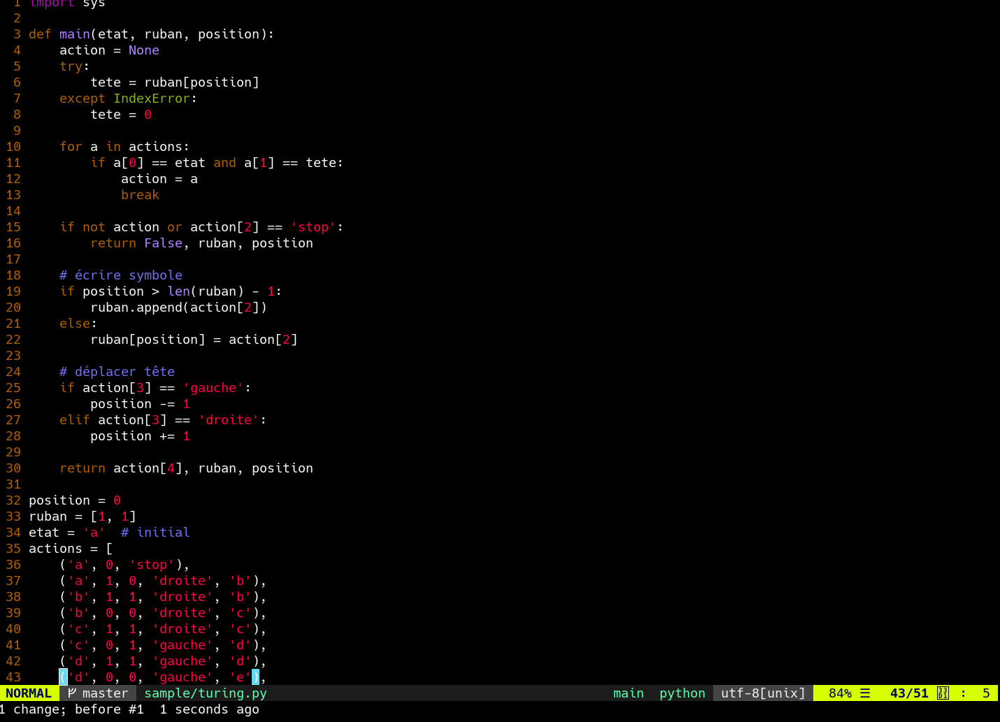
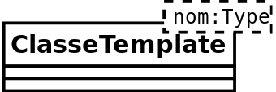

# Algorithmie


### Formation

---
## Principes généraux

- suite d'opérations ou d'instructions
- pour résoudre un problème

Note:
- Un algorithme est une suite finie et non ambiguë d’opérations ou d'instructions permettant de résoudre un problème ou d'obtenir un résultat
- Un problème est un objet mathématique qui représente une question ou un ensemble de questions auxquelles un ordinateur devrait être en mesure de répondre.

---


---

# L'algorithmique

Note:
- L'algorithmique est l'étude et la production de règles et techniques qui sont impliquées dans la définition et la conception d'algorithmes,
- c'est-à-dire de processus systématiques de résolution d'un problème permettant de décrire précisément des étapes pour résoudre un problème algorithmique.
- Un algorithme prend des données en entrées et calcule des données en retour

---

# Antiquité

- -3000BC: Babyloniens |
- ~300BC: Euclide PGCD |
- ?-212BC: Archimède $$π^2$$ |

Note:
- Les premiers algorithmes dont on a retrouvé des descriptions datent des Babyloniens, au IIIe millénaire av. J.-C.. Ils décrivent des méthodes de calcul et des résolutions d'équations à l'aide d'exemples.
- Un algorithme célèbre est celui qui se trouve dans le livre 7 des Éléments d'Euclide, et appelé algorithme d'Euclide. Il permet de trouver le plus grand diviseur commun, ou PGCD, de deux nombres.
- C'est Archimède qui proposa le premier un algorithme pour le calcul de $$π^2$$

---

# Al-Khwârizmî
## 813-833


Note:
- Le premier à avoir systématisé des algorithmes est le mathématicien perse Al-Khwârizmî, actif entre 813 et 833. |
- Dans son ouvrage Abrégé du calcul par la restauration et la comparaison, il étudie toutes les équations du second degré et en donne la résolution par des algorithmes généraux.
- Il utilise des méthodes semblables à celles des Babyloniens, mais se différencie par ses explications systématiques là où les Babyloniens donnaient seulement des exemples.
- Le mot algorithme vient du nom du mathématicien (latinisé au Moyen Âge en Algoritmie), qui, au IXe siècle écrivit le premier ouvrage systématique donnant des solutions aux équations linéaires et quadratiques. Algorithme a donné algorithmique auxquels certains préfèrent le néologisme algorithmie.

---

# Averroès
## 1126-1198


Note:
Le savant andalou Averroès (1126-1198) évoque une méthode de raisonnement où la thèse s’affine étape par étape, itérativement, jusqu’à une certaine convergence et ceci conformément au déroulement d’un algorithme. À la même époque, au XIIe siècle, le moine Adelard de Bath introduit le terme latin de algorismus, par référence au nom de Al Khuwarizmi. Ce mot donne algorithme en français en 1554.

---

# René Descartes
## XVIIe siècle

« diviser chacune des difficultés que j’examinerois, en autant de parcelles qu’il se pourroit, et qu’il seroit requis pour les mieux résoudre. » |

Note:
- Au XVIIe siècle, on pourrait entrevoir une certaine allusion à la méthode algorithmique chez René Descartes dans la méthode générale proposée par le Discours de la méthode (1637), notamment quand, en sa deuxième partie, le mathématicien français propose
- Sans évoquer explicitement les concepts de boucle, d’itération ou de dichotomie, l’approche de Descartes prédispose la logique à accueillir le concept de programme, mot qui naît en français en 1677.
- En 1843 , la mathématicienne et pionnière des sciences informatique Ada Lovelace, fille de Lord Byron et assistante de Charles Babbage réalise la première implémentation d'un algorithme sous forme de programme (calcul des nombres de Bernoullii)

---

# David Hilbert
## 1900

Note:
- Lors du deuxième congrès international des mathématiciens, tenu à Paris en août 1900, David Hilbert présenta une liste de problèmes qui tenaient jusqu'alors les mathématiciens en échec. Ces problèmes devaient, selon Hilbert, marquer le cours des mathématiques du XXe siècle, et l'on peut dire aujourd'hui que cela a été grandement le cas. Publiée après la tenue du congrès, la liste définitive comprenait 23 problèmes, aujourd'hui appelés les problèmes de Hilbert.
- Le dixième problème de Hilbert qui fait partie de la liste des 23 problèmes posés par David Hilbert en 1900 à Paris est clairement un problème algorithmique. En l'occurrence, la réponse est qu'il n'y a pas d'algorithme répondant au problème posé.

---

# Alan Turing
## 1936


Note:
- L’algorithmique des XXe et XXIe siècles a pour fondement mathématique des formalismes, par exemple celui des machines de Turing, qui permettent de définir précisément ce qu'on entend par "étapes", par "précis" et par "non ambigu" et qui donnent un cadre scientifique pour étudier les propriétés des algorithmes.
- Cependant, suivant le formalisme choisi on obtient des approches algorithmiques différentes pour résoudre un même problème. Par exemple l'algorithmique récursive, l'algorithmique parallèle ou l’informatique quantique donnent lieu à des présentations d'algorithmes différentes de celles de l'algorithmique itérative.

---

# Donald Knuth
## deuxième moitié du XXe siècle

Note:
Grâce à l'informatique, l'algorithmique s'est beaucoup développée dans la deuxième moitié du XXe siècle. Donald Knuth, auteur du traité The Art of Computer Programming, qui décrit de très nombreux algorithmes, a contribué, avec d'autres, à en poser les fondements mathématiques de leur analyse.

---

# L'algorithmique dans le projet

“One of my most productive days was throwing away 1000 lines of code.” – Ken Thompson

Note:
- Ecrit par l'être humain, l'algorithme est traduit en instructions compréhensibles par l'ordinateur.
- Sa première fonction est d'être comprise par un autre être humain dans l'équipe de développement etc

---

### Environnement de développement


Note:
- En programmation informatique, un environnement de développement est un ensemble d'outils pour augmenter la productivité des programmeurs qui développent des logiciels
- Il comporte un éditeur de texte destiné à la programmation, des fonctions qui permettent, de démarrer le compilateur ou l'éditeur de liens ainsi qu'un débogueur en ligne, qui permet d'exécuter ligne par ligne le programme en cours de construction.

---

### Selon les languages


Note:
- Certains environnements sont dédiés à un langage de programmation en particulier. Il ne faut pas hésiter a tout essayer pour voir ce qui permet d'arriver a ses fins le plus facilement.
- Les outils qui assistent les développeurs dans toutes les étapes de la réalisation du logiciel: définition, conception, programmation, test et maintenance.
- Ces outils tiennent également compte des différents rôles au sein d'une équipe de programmation

---
## Environnement de développement: éditeur de code



Note:
Toujours un éditeur de texte incorporé, avec souvent la possibilité de le remplacer par un autre éditeur. typiquement des fonctions de mise en évidence alignées avec le langage de programmation: indentation automatique des blocs de code, marquage des délimiteurs (parenthèses ou accolades), et mise en évidence des mots clés du langage par de la couleur ou des caractères gras

---

## Environnement de développement: création d'interface graphique


Note:
- Un tel outil permet au programmeur de gagner un temps significatif dans la construction de l'interface graphique de son programme. Jusqu'à l'arrivée de la technologie Java, de tels outils ciblaient toujours un système d'exploitation en particulier.

---
## Environnement de développement: automatisation des tests


Note:
- outil pour réaliser automatiquement des tests
- car le meilleur moyen de vérifier un algorithme complexe est souvent de créer un deuxième algorithme pour tester le premier
- TDD

---

## Principe d'une machine à état

- Un automate fini est une construction mathématique abstraite, |
- susceptible d'être dans un nombre fini d'états, |
- mais étant un moment donné dans un seul état à la fois ; |
- l'état dans lequel il se trouve alors est appelé l'« état courant ». |
- Le passage d'un état à un autre est activé par un événement ou une condition ; |
- ce passage est appelé une « transition ». |

---?image=assets/image/automates.png

---

# Exemples de machines à état

- distributeur automatique de boisson,
- portillon,
- ascenseurs,
- digicodes,
- citez des machines à état |


---

Un automate particulier est défini par l'ensemble de ses *états* et l'ensemble de ses *transitions*.

Note:
Vus comme un modèle de calcul les automates finis ont un potentiel faible ; ils ont bien moins de puissance de calcul qu'une machine de Turing. En d'autres termes, il y a des tâches qu'un automate fini ne peut pas accomplir alors qu'un automate à pile ou une machine de Turing le pourront. Ceci est principalement dû au fait qu'un automate fini a une mémoire limitée à son nombre d'états.

---

### Machine de Turing

- un alphabet fini,
- un ruban infini,
- une tête de lecture et écriture,
- un ensemble fini d'états,
- une table d'actions,
- un etat initial,

Note:
- En informatique théorique, une machine de Turing est un modèle abstrait du fonctionnement des appareils mécaniques de calcul, tel un ordinateur et sa mémoire.
- Ce modèle a été imaginé par Alan Turing en 1936, en vue de donner une définition précise au concept d’algorithme ou de « procédure mécanique » |
- Il est toujours largement utilisé en informatique théorique, en particulier dans les domaines de la complexité algorithmique et de la calculabilité. |

---

# Alphabet fini

| A | 00 |
| - | -- |
| B | 01 |
| C | 11 |

Note:
L'alphabet contient un symbole spécial appelé « symbole blanc » et un ou plusieurs autres symboles.
On peut toujours encoder un symbole de l'alphabet en une suite de 1 et de 0, par exemple sur deux bits pour trois caractères:
Sur un ruban de 0 et de 1 on peut donc décider d'encoder des symboles d'alphabets de plus grandes tailles. Par exemple, UTF-8 utilise 8 bits par symbole et contient la plupart des symboles d'alphabets utilisés par les humains. Cela consomme simplement plus d'espace que pour trois caractères.

---

# Ruban infini

| 00 |
| -- |
| 01 |
| 11 |
| 01 |
| .. |

Note:
Le ruban infini est divisé en cases consécutives.
Chaque case contient un symbole parmi un alphabet fini.
Le ruban est supposé être de longueur infinie vers la gauche ou vers la droite
Donc la machine doit toujours avoir assez de longueur de ruban pour son exécution.
On considère que les cases non encore écrites du ruban contiennent le symbole « blanc »

---

# Registre d'état

Note:
Le registre d'état mémorise l'état courant de la machine de Turing.
Le nombre d'états possibles est toujours fini, et il existe un état spécial appelé « état de départ » qui est l'état initial de la machine avant son exécution ;

---

### Table d'actions / transitions

La table d'actions indique à la machine:

- quel symbole écrire sur le ruban,
- dans quel sens déplacer la tête de lecture,
- quel est le nouvel état,

En fonction:

- de l'état courant de la machine,
- du symbole lu sur le ruban par la tête de lecture,

---

# Tête de lecture / écriture

Note:
La tête de lecture/écriture peut lire et écrire les symboles sur le ruban, et se déplacer vers la gauche ou vers la droite du ruban.
À chaque étape de son calcul, la machine exécute l'action correspondante à son actuel et au symbole lu par la tête de lecture. L'action correspond soit à l'arrêt de la machine, soit à l'écriture d'un symbole sous la tête de lecture, du déplacement de la tête de lecture du coté défini par l'action, et du changement d'état défini par l'action.

---

### Résumé

- un alphabet fini,
- un ruban infini,
- une tête de lecture et écriture,
- un ensemble fini d'états,
- une table d'actions,
- un etat initial,

Note:
Une « machine » de Turing est un concept abstrait, c'est-à-dire un objet mathématique comportant :
- un ruban infini de symboles de l'alphabet
- une tête de lecture/écriture qui peut lire et écrire les symboles sur le ruban,
- et se déplacer vers la gauche ou vers la droite du ruban
- un registre d'état qui mémorise l'état courant de la machine de Turing
- une table d'actions
Le nombre d'états possibles est toujours fini, et il existe un état spécial appelé « état de départ » qui est l'état initial de la machine avant son exécution.
Si aucune action n'existe pour une combinaison donnée d'un symbole lu et d'un état courant, la machine s'arrête.

---

### La machine de Turing lit un ruban et écrit le résultat dessus.

Note:
Le ruban est supposé être de longueur infinie vers la gauche ou vers la droite, en d'autres termes la machine doit toujours avoir assez de longueur de ruban pour son exécution. On considère que les cases non encore écrites du ruban contiennent le symbole « blanc »

---

# Turing-complete

Note:
Une machine de Turing universelle a potentiellement la capacité de calculer tout ce qui est calculable, on dit alors qu'elle est Turing-complète. En lui fournissant le codage adéquat, elle peut simuler toute fonction récursive, analyser tout langage récursif, et accepter tout langage partiellement décidable. Selon la thèse de Church-Turing, les problèmes résolubles par une machine de Turing universelle sont exactement les problèmes résolubles par un algorithme ou par une méthode concrète de calcul.

---

# Universalité de Turing

Note:
Comme Alan Turing le montre dans son article fondateur, il est possible de créer une machine de Turing qu'on appelle « machine de Turing universelle » et qui est capable de « simuler » le comportement de n'importe quelle autre machine de Turing. « Simuler » signifie que si la machine de Turing universelle reçoit en entrée un codage d'une machine et des données, et produit le même résultat que la machine codée à laquelle on donnerait en entrée les mêmes données.

---

# Simulation de machine de Turing

Note:
Il est assez aisé de simuler une machine de Turing sur un ordinateur moderne, mais il y a une contrainte ! En effet alors que la mémoire d'un ordinateur est finie celle d'une machine de Turing est infinie. Ainsi la machine de Turing n'engendrera pas de débordement mémoire tandis qu'un ordinateur pourra le faire.

---?code=sample/turing.py&lang=python&title=Turing machine in Python

@[3](Fonction qui prend en argument l'etat, le ruban et la position)
@[4](Definition de la variable d'action)
@[5-6](Lire le symbole sur le ruban dans la variable tete)
@[7-8](Autrement caractere blanc, ici le 0)
@[10](Boucle sur la table d'actions)
@[11-12](Compare l'etat et le symbole de la position sur le ruban)
@[13](Sors de la boucle)
@[15](Si pas d'action ou action terminale)
@[16](Quitter la fonction pour revenir a la frame parente)
@[18](Un commentaire de bichette)
@[19-20](Ajouter le symbole de l'action si au bout du ruban)
@[21-22](Autrement ecrire le symbole de l'action a la position)
@[24](Commentaire de biche)
@[25-28](Changer la position de la tete)
@[30](Retourner les variables)
@[32](Position initiale)
@[33](Ruban avec le symbole 1 deux fois de suite)
@[34](Etat initial, avec commentaire de bichette)
@[35-46](Table d'actions)
@[49](Tant que la fonction ne retourne pas un etat False)
@[50](Appeler la fonction recursive)
@[51](Afficher vaillament les variables)

---

# Les variables : définition

- mathématiques
- physique |

Note:
- En mathématiques et en logique, une variable marque un rôle dans une formule, un prédicat ou un algorithme.
- En physique, en biologie, en mécanique et en chimie, la variable représente un paramètre mesurable comme la température, le temps, la vitesse ou l'intensité.

---

# Variables en informatique

```python
hello = 'world'
```

Note:
- En informatique, les variables sont des symboles qui associent un nom (l'identifiant) à une valeur. La valeur peut être de quelque type de donnée que ce soit. Le nom doit être un identifiant unique (et si le langage en possède, différents des mots-réservés).
- En informatique, une variable est un symbole (habituellement un nom) qui renvoie à une position de mémoire dont le contenu peut prendre successivement différentes valeurs pendant l'exécution d'un programme.

---

### Variable C++

Par exemple une variable en C++ aura six caractéristiques :

- nom
- durée de vie
- type
- valeur
- adresse
- portée
- visibilité

---

### Nom de variable

```c
    _var
    __var2
    Var
```

Note:
- Dans certains langages, les noms de variables (comme ceux des identificateurs) doivent nécessairement commencer par une lettre (majuscule ou minuscule) ou par un $. Les autres caractères composant le nom de la variable doivent être une lettre, un chiffre. La différenciation des majuscules et des minuscules (sensibilité à la casse) dans le nom d'une variable dépend du langage considéré.
- En Python, il n’y a pas de déclaration de type. Le nom d’une variable a donc d’autant plus d’importance pour expliquer ce qu’il y a dedans.

### Nom invalide

    2var

Note:
- Exemple de nom de variable non valide en C
- Ainsi, le premier caractère ne peut être un chiffre, car cela permet de faciliter la compilation ou l'interprétation du programme en ôtant une ambiguïté : quand le compilateur lit un chiffre, il sait que les caractères qui suivront constitueront une valeur numérique. De même, s'il lit une lettre ou un souligné, il saura qu'il a affaire à une variable.

---

# Nom de variable: exemple

Est-ce-qu'on comprend ce que fait cet algorithme en Python ?

```python
best = []
for k, v in data.items():
    if v > top:
        best.append(k)
```

---

Est-ce-que c'est plus clair avec des noms explicites ?

```python
best_players = []
for player, score in data.items():
    if score > top_score :
        best_players.append(player)
```

---

# Variables et constantes

```c
const char c1;           //Le caractère ne peut être modifié
const char * c2;         //Le caractère ne peut être modifié
char * const c3;         //Le pointeur vers le caractère ne peut être modifié
const char * const c4;   //Le pointeur ET le caractère pointé ne peuvent être modifiés
```

Note:
- Dans un langage de programmation, une variable est un espace de stockage pour un résultat. Cependant les possibilités d'une variable sont intimement liées au langage de programmation auquel on fait référence.
- Une constante est un symbole associé à une valeur fixe. Syntaxiquement, cet identificateur a tous les aspects d'une variable. Cependant, il lui est affecté une valeur définie, c'est-à-dire constante, comme la taille d'un plateau d'échecs (8x8).

---

# Variables: cycle de vie

Note:
- Dans la plupart des langages et notamment les plus courants, les variables peuvent changer de valeur au cours du temps (dynamique). Dans les langages de certains paradigmes, notamment la programmation fonctionnelle, leur valeur est au contraire figée dans le temps (statique).
- Une variable contient une valeur qui peut avoir différent valeurs au cours de différentes exécutions, comme un jeu tel que démineur joué sur un plateau dont le joueur choisit la taille.
- Pour chaque constante et variable du programme, l'ordinateur réserve une partie de sa mémoire (RAM), de taille adéquate au type de données.

---

- déclaration |
- définition |
- affectation |
- lecture |
- suppression |

Note:
- la déclaration du nom, éventuellement avec type,
- la définition permet d'allouer/associer une zone mémoire qui va être utilisée pour stocker la variable, comme lorsqu'on lui donne une valeur initiale,
- l'affectation consiste à attribuer une valeur à une variable,
- la lecture consiste à utiliser la valeur liée à la variable,
- la suppression réalisée soit automatiquement soit par une instruction du langage.

---

# Typage

Note:
En programmation informatique, un type de donnée, ou simplement type, définit la nature des valeurs que peut prendre une donnée, ainsi que les opérateurs qui peuvent lui être appliqués.

---

# Types prédéfinis

- Type booléen : valeurs vrai ou faux — ou respectivement 1 ou 0 ; |
- Type entier signé ou non signé : valeurs codées sur 8 bits, 16 bits, 32 bits voire 64 bits. |
- Type réel en virgule flottante. |
- et bien d'autres, des idées ? |

Note:
- Tous les langages de programmation offrent des types de base correspondant aux données qui peuvent être traitées directement — à savoir : sans conversion ou formatage préalable — par le processeur. Ces types de base sont souvent :
- Les langages permettant un accès direct à la mémoire du système offrent par ailleurs le type pointeur, et un type octet.
- Beaucoup proposent également un type prédéfini, string, pour les chaînes de caractères. Les langages de haut niveau peuvent également supporter nativement des types correspondant à d'autres structures de données.

---

# Types paramétrés

Par exemple la déclaration des pointeurs ou des tableaux en langage C nécessite de préciser le type qui doit servir de base aux données manipulées. La programmation générique étend cette pratique pour permettre à l'utilisateur de créer ses propres types paramétrés.

```java
Collection<String> coll = new LinkedList<String>();
```

---

# Types énumérés

Des langages permettent au développeur de définir des types spécifiques à son application. Les types énumérés correspondent à des ensembles « finis » (cf. les remarques ci-après) de valeurs possibles pour une variable. Le code suivant illustre la définition d'un nouveau type, suivie de la déclaration d'une variable typée :

```c
type couleur : {rouge, bleu, vert};
var c : couleur;  // La variable c, du type couleur, peut prendre les valeurs
	                // rouge, bleu ou vert uniquement.
```

---

# Types composés

Les types composés (struct en C, record en Pascal) permettent de grouper plusieurs champs de types distincts dans une même variable (qui contient alors des « sous-variables »).

En programmation orientée objet, on nomme classe un type composé associé à du code spécifique — la définition des méthodes de la classe — propre à la manipulation de variables de ce type.

---

# Types hiérarchiques

La programmation orientée objet étend le paradigme précédent en organisant hiérarchiquement les classes de telle manière qu'une variable d'une sous-classe puisse être utilisée de manière transparente à la place de n'importe quelle classe située à un niveau supérieur dans la hiérarchie définie.

---

# Types opaques

Un type opaque est un type incomplètement défini et/ou dont la nature est masquée. Le développeur ne peut ni en examiner le contenu, ni le modifier, et doit simplement le stocker et le transmettre. À cet effet, seule la taille d'un type opaque est réellement connue.

Typiquement, les données opaques sont des handles (terminologie Windows), des descripteurs de fichier (terminologie Unix), des clés, des pointeurs vers des structures masquées (ex. : `FILE*` de la bibliothèque standard du C), etc. La seule notion cruciale, c'est qu'une variable opaque est fournie via une fonction dédiée de création (de type constructeur), transmise telle quelle aux fonctions utilisatrices (souvent via un passage par référence), et enfin détruite via une fonction de libération (de type destructeur).

La possibilité – ou non – d'avoir des types opaques est totalement dépendante du langage de programmation utilisé.

---

# Résumé des types de données

- prédéfinis: booléan, entier (signé/non-signé), réel (virgule flottante), ... |
- paramétrés: types qui prennent d'autres type en paramètre, |
- énumérés: ensembles « finis » de valeurs possibles, |
- composés: struct (C), record (Pascal), class (Python),
- hiérarchiques: sous classes
- opaques: descripteurs de fichiers, clés ...

---

# Typage statique et typage dynamique

On parle de typage statique quand la majorité des vérifications de type sont effectuées au moment de la compilation.

Au contraire, on parle de typage dynamique quand ces vérifications sont effectuées pendant l'exécution.

---

# Typage explicite et typage implicite

Le typage explicite oblige l'utilisateur à indiquer les types qu'il utilise, par exemple lors des déclarations de variables ou de fonctions.

Par exemple, en langage C, le typage est explicite :

```c
int i = 0;  // cette déclaration indique explicitement que
            // la variable i est de type entier
```

Au contraire, le typage implicite permet au développeur de laisser le compilateur ou le runtime le soin de déterminer tout seul les types de données utilisées.

Par exemple, en Objective Caml, le typage est implicite :

```
let i = 0 ;; (* le compilateur détermine automatiquement que
                la variable i est de type entier *)
```

---

# Typage fort et typage faible

La sûreté du typage est destinée à prévenir les erreurs de type, à savoir : l'emploi d'une variable dont le format est incompatible. La définition d'un langage fortement typé est assez floue :

- soit elle est à rapprocher de celle de langage à typage statique : le compilateur assure la détection au plus tôt des erreurs de type
- soit on juge de la force du typage d'un langage selon les conversions de type implicites qu'il autorise.


---

# Adresse de variable

La mémoire RAM est composée de cellules. Chaque cellule a un numéro, c'est son **adresse**.

La mémoire comporte un grand nombre d'adresses, commençant à l'adresse numéro 0 et se terminant à l'adresse numéro (insérez un très grand nombre ici). Le nombre d'adresses disponibles dépend en fait de la quantité de mémoire dont dispose votre ordinateur.

---

# Valeur de variable

À chaque adresse, on peut stocker un nombre. Un et UN SEUL nombre. On ne peut pas stocker deux nombres par adresse.

Votre mémoire n'est faite que pour stocker des nombres. Elle ne peut stocker ni lettres ni phrases. Pour contourner ce problème, on a inventé une table qui fait la liaison entre les nombres et les lettres. Cette table dit par exemple : « Le nombre 89 représente la lettre Y ». Nous reviendrons dans un prochain chapitre sur la gestion des caractères ; pour l'instant, nous nous concentrons sur le fonctionnement de la mémoire.

---

# Visibilité de variable

`+`: accès public: Toutes les autres classes ont accès à cet attribut.
`#`: accès protégé: Seules la classe elle-même et les classes filles (héritage) ont accès à cet attribut.
`~`: accès package: Classe visible uniquement dans le package.
`-`: accès privé: Seule la classe elle-même a accès à cet attribut.

---

# Durée de vie de variable

On distingue généralement cinq opérations sur les variables, chacune pouvant revêtir des formes syntaxiques différentes.

- la déclaration permet de déclarer un nom de variable, éventuellement de lui associer un type,
- la définition permet d'associer une zone mémoire qui va être utilisée pour stocker la variable, comme lorsqu'on lui donne une valeur initiale,
- l'affectation consiste à attribuer une valeur à une variable,
- la lecture consiste à utiliser la valeur liée à la variable,
- la suppression réalisée soit automatiquement soit par une instruction du langage.

Dans les langages de programmation fonctionnelle ou de programmation logique, les variables ne peuvent être associées qu'à une seule valeur au cours de leur existence.

---

Les langages, comme le C, Caml ou Pascal, imposent de déclarer une variable voire de lui donner un type avant son usage. La déclaration imposée des variables permet au compilateur ou à l'interpréteur d'identifier les erreurs typographiques comme des variables non déclarées ou des variables homonymes. D'autres langages effectuent la déclaration au moment de la première affectation (c'est le cas de la plupart des langages de script) ou lors de leur première apparition dans le code (comme dans Prolog).

---

En ce qui concerne l'initialisation des variables, c'est-à-dire l'association d'une première valeur, certains langages imposent d'initialiser une variable avant sa première lecture alors que d'autres fournissent une valeur implicite (spécifiée ou indéterminée). Des langages comme Oz ou Prolog ne réalisent pas à proprement parler d'initialisation. Lors de la déclaration des variables aucune valeur n'est associée, on dit que la variable n'est pas liée. La valeur de la variable est déterminée au fur et à mesure de l'exécution du programme, on parle alors d'unification.

---

# Variables : Résumé

- **nom**: sous quel nom est déclarée la variable
- **type**: convention d'interprétation de la séquence de bits qui constitue la variable. Le type de la variable spécifie aussi la longueur de cette séquence (8 bits, 32 bits, 64 bits) |
- **valeur**, la séquence de bits elle-même, ne peut varier dans le cas d'une variable **constante** |
- **adresse**: l'endroit dans la mémoire où la valeur est stockée |
- **portée**: portion de code source où elle est accessible |
- **visibilité**: ensemble de règles fixant qui peut utiliser la variable (exemple : mots-clefs public, private, protected, ou le masquage d'une variable par une autre) |
- **durée de vie**: temps d'exécution pendant laquelle la variable existe. |

en C et en C++ une variable contenue dans un bloc de code limité par des accolades "{}" possède la durée de vie correspondant au temps d'exécution de ce bloc. Il ne faut pas confondre la durée de vie d'une variable locale et sa visibilité, ou sa portée : une variable hors de portée (ex : masquée par une autre), existe toujours. |

---

# Simplification

Toutefois on peut trouver des langages qui simplifient ces caractéristiques :

- la notion de variable est complétée par la notion de pointeur (variable qui contient une adresse) dans tous les langages qui permettent la création dynamique de variable (new en C++, Java); L'adresse contenu dans la variable pointeur peut être inaccessible au programmeur (PHP, Java), ou directement accessible (C++).
- le PHP ne possède pas un typage fort, comme une grande partie des langages scripts ;
- le Prolog ne permet pas qu'une variable change de valeur au cours du temps une fois la première identification faite ;
- la visibilité de la variable est public par défaut en C ;
- la notion de pointeur en C++ est remplacée par la notion de référence en Java, en Prolog l'adresse d'une variable n'est pas accessible au programmeur.

Typiquement, le but des langages dits de "scripting" est d'être plus faciles à manipuler pour résoudre des problèmes avec des algorithmes sur mesure.

---

# Structures de contrôle

Un bloc d'instruction regroupe plusieurs instructions contiguës.

Une structure de contrôle est une instruction particulière d'un langage de programmation impératif pouvant dévier le flot de contrôle du programme la contenant lorsqu'elle est exécutée.

Une structure de contrôle permet de décider si on rentre dans un bloc d'instruction ou pas.

---

# Structures de contrôle: conditions

Les sauts conditionnels permettent de réaliser un branchement si une condition est vérifiée. Si la condition n'est pas vérifiée, l'exécution se poursuit séquentiellement.

Structure si-alors(-sinon):

```
If (condition booléenne) Then
   (conséquent)
Else
   (alternative)
End If
```

---

# Exemple de si-alors-sinon en Python

```python
print('Départ')

a = 1
if a == 1:
    print('Vré')
else:
    print('Faux!')

print('Fin')
```

Affichera:

```
Départ
Vré
Fin
```

---

# Structures de contrôles : les boucles

Une boucle est une structure de contrôle destinée à exécuter une portion de code plusieurs fois de suite, la structure de contrôle branchant le pointeur ordinal au début du code tant qu'une condition de continuation est remplie ou, selon les boucles, qu'une condition de sortie n'est pas remplie.

---

# Types de boucles

Les langages proposent en général plusieurs type de boucles :

- boucle à pré-condition : la condition est vérifiée avant la première boucle
- boucle à post-condition : la condition est vérifiée après la première boucle
- boucle à condition d'arrêt : la condition est vérifiée au milieu de la boucle
- boucle itérative : un compteur est utilisé pour compter le nombre d'itérations
- boucle de parcours : la boucle est exécutée sur chacun des éléments d'une liste

---

# Boucles pré/post condition

Les langages peuvent proposer plusieurs type de boucles à pré et post-condition :

- boucle "tant que", qui est exécuté tant que la condition est vraie (en précondition : "while test ; do quelquechose; done". En postcondition : "do quelquechose; while test")
- boucle "jusqu'à (ce que)", qui est exécuté jusqu'à ce que la condition soit vraie (pré condition "until test ; do quelquechose; done". En postcondition, "do quelquechose ; until test")

---

# Exemple de boucle "tant que"

Structure:

```
While (condition booléenne) Then
   (conséquent)
End While
```

Exemple:

```python
a = 3
while a > 0:
    print(a)
    a = a - 1
```

Affichera:

```
3
2
1
```

---

# Exemple de boucle "jusqu'à"

Structure:

```
Until (condition booléenne) Then
   (conséquent)
End While
```

Exemple:

```bash
a = 3
until (( a == 0 )); do
    a=$(( a - 1))
    echo $a
done
2
1
0

```

Affichera:

```
3
2
1
```

---

# Les mécanismes d'erreurs

Note:
- Dans le contexte des langages de programmation fonctionnels et impératifs, un système de gestion d'exceptions ou SGE permet de gérer les conditions exceptionnelles pendant l'exécution du programme. Lorsqu'une exception se produit, l'exécution normale du programme est interrompue et l'exception est traitée.
- Les erreurs/exceptions les plus courantes sont probablement l'accès non autorisé à une zone mémoire (erreur de manipulation de pointeur) et la division par zéro (on ne prévoit pas le cas où le diviseur est nul).
- Tout programme en exécution peut être sujet à des erreurs pour lesquelles des stratégies de détection et de réparation sont possibles. Ces erreurs ne sont pas des bugs mais des conditions particulières (ou conditions exceptionnelles, ou exceptions) dans le déroulement normal d'une partie d'un programme
- Par exemple, l'absence d'un fichier utile n'est pas un bogue du programme ; par contre, ne pas gérer son absence en provoquerait un.

---

# Types d'erreurs:

- arithmétique (débordement, division par zéro…)
- collections (débordement d'indices)
- allocation mémoire (mémoire insuffisante)
- signaux système (interruption du programme par le système d'exploitation)

Note:
- Les exceptions suivantes peuvent survenir dans pratiquement tous les programmes
- Dans certains langages à objets, le type d'une exception doit impérativement être une classe. Une hiérarchie prédéfinie et extensible de types d'exceptions, correspondant au type des erreurs qu'elles représentent, est fournie. D'autres langages, comme C++, autorisent aussi les types primitifs.

---

# Exception arithmétique en Python

```python
>>> 123/0
Traceback (most recent call last):
  File "<stdin>", line 1, in <module>
ZeroDivisionError: division by zero
```

---

# Gestionnaire d'exceptions

```python
try:
    qqchose()
except UneException:
    pass
```

Note:
- Un gestionnaire d'exception établit un ensemble de routines de traitement d'erreurs, définies par le programmeur, sur un bloc (dans une fonction ou une méthode du programme) ; ces routines sont activées pendant toute la durée d'exécution du bloc protégé.
- La notion d'exécution du bloc protégé inclut toute la chaîne d'appels (de fonctions, procédures ou méthodes) à partir de ce bloc : on dit que les gestionnaires d'exception sont actifs dans la portée dynamique du bloc.
Le traitement des situations exceptionnelles fait apparaître deux besoins :
- une syntaxe spéciale, pour distinguer l'exécution normale du traitement des erreurs,
- un flot de contrôle « non local », pour traiter et réparer les situations exceptionnelles.

---

# Declenchement d'exception

```python
def object_get(id):
    result = Objects.get(id=id)
    if not result:
        raise ObjectNotFoundException(id)
```

Note:
- Le signalement d'une exception peut être automatique, s'il correspond à une exception définie dans le langage de programmation ou une bibliothèque fournie, ou bien déclenché par le programmeur par l'utilisation d'une primitive de signalement. Il est généralement possible de construire de nouveaux types d'exceptions et de programmer leur signalement.
- Le gestionnaire d'exception peut être complété par un ensemble de restarts, qui sont des routines permettant la modification des environnements lexicaux entre le site de signalement et le point d'établissement des gestionnaires d'exception. Un restart permet à un gestionnaire d'exception de choisir de réparer et redémarrer un calcul plutôt que de l'abandonner intégralement. Un restart est également actif dans la portée dynamique du bloc sur lequel il est défini.

---

# Procédures

```python
def direbonjour():
    print('Bonjour le monde !')

>>> direbonjour()
Bonjour le monde !
```

Note:
- En informatique, une routine est une entité informatique qui encapsule une portion de code (une séquence d'instructions) effectuant un traitement spécifique bien identifié (asservissement, tâche, calcul, etc.) relativement indépendant du reste du programme, et qui peut être réutilisé dans le même programme, ou dans un autre. Dans ce cas, on range souvent la routine dans une bibliothèque pour la rendre disponible à d'autres projets de programmation, tout en préservant l'intégrité de son implémentation.
- La procédure est Une routine qui ne retourne aucune valeur, réalise une opération (tâche) bien déterminée et dont l'emploi joue le rôle d'une instruction ad-hoc.
- Vous devez déclarer et définir une procedure avant de l'invoquer. Soit en deux temps, soit d'une traite.

---

# Déclaration

```python
def dire(quoi: str):
	print(quoi)
```

- un mot-clé (procedure, function, action, etc.) dans le cas d'une routine dans un langage les distinguant clairement |
- l'identifiant de la routine (nom donné par le programmeur à la routine) |
- la description des paramètres indiquant pour chacun (s'il y a des paramètre) |
  - l'identifiant (nom) du paramètre |
  - le type (explicite ou implicite) du paramètre (dans le cas d'une routine dans un langage typé) |
- un corps contenant le code réalisant l'opération dévolue à cette routine |

---

# Invocation

```python
>>> direbonjour()
Bonjour le monde !
```

Note:
Les procédures permettent de diviser un problème en décomposant le programme à réaliser en portions de code plus faciles à produire, à utiliser, à gérer et à entretenir. Les instructions réalisant la routine sont encapsulées à l'intérieur de celle-ci et le programmeur peut faire appel à la routine sans se préoccuper des détails internes à celle-ci ; la routine joue le rôle d'une boite noire dans les routines qui l'emploient.

---

# Paramètres

```python
def dire(quoi: str):
	print(quoi)

>>> dire('Bonjour')
Bonjour
```

Note:
- une copie des arguments provenant de la routine appelante est reçue dans les paramètres de la routine appelée (routine invoquée) au lieu de travailler sur les véritables variables de la routine appelante
- Cependant, les routines demandent souvent l'adresse mémoire des variables de la routine appelante (arguments) plutôt que leurs valeurs: quoi n'est pas une copie de la chaine mais un pointeur vers la chaine de caractères définis dans la routine appelante
- Le corps de la routine comprend :
  - la définition des variables locales à la routine, certaines de ces variables n'existant que le temps de son exécution;
  - la séquence des instructions à exécuter.

---

# Valeurs de retour

```python
def ajouterun(nombre: int):
    resultat = nombre + 1
    return resultat
```

Note:
- Une fonction peut renvoyer un seul résultat par sa valeur de retour. Ce résultat peut, entre autres, être :
  - de grande taille, comme une chaîne de caractères en PL/I ou une structure en C ;
  - une adresse en mémoire ;
  - un simple code d'erreur (en) (par exemple 0 si l'opération s'est bien terminé).

---

# Callbacks

```python
def ajouterunetappeler(nombre, callback):
    resultat = nombre + 1
    callback(resultat)

def afficherresultat(resultat):
    print(resultat)

ajouterunetappeler(3, afficherresultat)
```

Note:
- En informatique, une fonction de rappel (callback en anglais) ou fonction de post-traitement est une fonction qui est passée en argument à une autre fonction. Cette dernière peut alors faire usage de cette fonction de rappel comme de n'importe quelle autre fonction, alors qu'elle ne la connaît pas par avance.
- La technique de la fonction de rappel s'inspire du principe d'Hollywood (ou Inversion de contrôle) où l'appelant laisse ses coordonnées pour pouvoir être rappelé par la suite. L'intérêt est le passage à un modèle événementiel et modulaire.

---

# Pointeurs de fonction

```c
int addInt(int n, int m) {
    return n+m;
}

int (*functionPtr)(int,int);

functionPtr = &addInt;

int sum = (*functionPtr)(2, 3); // sum == 5

int add2to3(int (*functionPtr)(int, int)) {
    return (*functionPtr)(2, 3);
}
```

@[1-3](Declaration d'une fonction basique vers laquelle nous allons pointer)
@[5](Definir un pointer de fonction qui prend 2 entiers en entree et en retourne 1 en sortie)
@[7](Maintenant nous pouvons pointer vers notre fonction)
@[9](Et utiliser le pointer pour appeler la fonction)
@[11-13](On peut passer le pointer a une autre fonction pour faire la meme chose)

Note:
- Les callbacks ont été très utilisées en programmation système et notamment en langage C. En effet, le C a permis assez tôt de passer des pointeurs de fonctions en paramètre d'autres fonctions. Cela le rendait techniquement capable d'implanter le mécanisme des fonctions de rappel.
- Le passage de fonction en paramètre est généralisé en programmation fonctionnelle. Toutefois dans ce cadre, on ne parle plus de fonction de rappel. Dans ce paradigme, les fonctions sont des éléments de première classe (au même titre que les constantes par exemple). Aussi, les fonctions qui peuvent prendre d'autres fonctions en argument et/ou renvoyer une fonction comme valeur de retour sont alors qualifiées de fonctions d'ordre supérieur.

---

# Délégués

```c#
public delegate void Del(string message);

public static void DelegateMethod(string message)
{
    System.Console.WriteLine(message);
}

Del handler = DelegateMethod;

handler("Hello World");
```

@[1](Definition du delegate, tout appel du delegate sera passé a la fonction déléguée de cette fonction)
@[3-6](Declaration et definition d'une fonction pour le déléguer)
@[8](Instanciation du délégué)
@[10](Appel du délégué)

Note:
- Le délégué est une methode d'objet avec éventuellement un objet attaché.

---

### Fonctions

Comme la procedure:

- un mot-clé (procedure, function, action, etc.) |
- l'identifiant de la routine (nom donné par le programmeur à la routine) |
- la description des paramètres indiquant pour chacun (s'il y a des paramètre) |
  - l'identifiant (nom) du paramètre |
  - le type (explicite ou implicite) du paramètre (dans le cas d'une routine dans un langage typé) |
- un corps contenant le code réalisant l'opération dévolue à cette routine |

Dans le cas d'une fonction, la déclaration d'une routine comporte aussi : |

- le type de la routine (dans le cas d'une fonction d'un langage typé), c'est-à-dire le type de sa valeur de retour |
- l'affectation, dans le corps de la routine, d'un résultat à sa valeur de retour |

Note:
- Une routine qui retourne une et une seule valeur, conformément à la définition mathématique de fonction.
- Contrairement a la procédure qui ne retourne rien
- la fonction est aussi une procédure

---

# Clotures

```python
def ajouteur(nombre):
    return lambda valeur: valeur + nombre

ajoute10 = ajouteur(10)
ajoute10(1)
```

Note:
- Une fermeture peut être passée en argument d'une fonction dans l'environnement où elle a été créée (passée vers le bas) ou renvoyée comme valeur de retour (passée vers le haut). Dans ce cas, le problème posé alors par la fermeture est qu'elle fait référence à des données qui auraient typiquement été allouées sur la pile d'exécution et libérées à la sortie de l'environnement. Hors optimisations par le compilateur, le problème est généralement résolu par une allocation sur le tas de l'environnement.

---

```python
def f():
    x = 0

    def g():
        nonlocal x
        x += 1
        return x

    return g

g = f()
g()
g()
g()
```

@[1](Definition de fonction)
@[2](Definition de variable locale)
@[4](Definition de cloture)
@[5](Le mot-clé nonlocal permet de modifier les variables non locales au lieu de les masquer par des variables locales)
@[6](Modification de variable de l'environnement lexical parent)
@[7](Retourner la variable)
@[9](Retourner la cloture)
@[11](Appeler la fonction retourne la cloture)
@[12](Retourne 1)
@[13](Retourne 2)
@[14](Retourne 3)

Note:
- Dans un langage de programmation, une fermeture ou clôture (en anglais : closure) est une fonction accompagnée de son environnement lexical. L'environnement lexical d'une fonction est l'ensemble des variables non locales qu'elle a capturé, soit par valeur (c'est-à-dire par copie des valeurs des variables), soit par référence (c'est-à-dire par copie des adresses mémoires des variables)1. Une fermeture est donc créée, entre autres, lorsqu'une fonction est définie dans le corps d'une autre fonction et utilise des paramètres ou des variables locales de cette dernière.

---

### Programation lambda

```c
int n = 2;
int inc(int k) { /* incrémentation par effet de bord */
  n = n + k;
  return n;
}
f(inc(1) + inc(1));
```

Note:
- La programmation fonctionnelle est un paradigme de programmation de type déclaratif qui considère le calcul en tant qu'évaluation de fonctions mathématiques.
- Comme le changement d'état et la mutation des données ne peuvent pas être représentés par des évaluations de fonctions1 la programmation fonctionnelle ne les admet pas, au contraire elle met en avant l'application des fonctions, contrairement au modèle de programmation impérative qui met en avant les changements d'état2.
- Un langage fonctionnel est donc un langage de programmation dont la syntaxe et les caractéristiques encouragent la programmation fonctionnelle. Alors que l'origine de la programmation fonctionnelle peut être trouvée dans le lambda-calcul

---

### Programation lambda: langages

- 1958: Lisp |
- 1975: Scheme |
- 1973: ML |
- 1984: Common Lisp |
- 1987: Haskell, Erlang, OCaml |
- 2002: F# |
- 2003: Scala |

---

## Programmation Orientée Objet

- 1960: Ole-Johan Dahl et Kristen Nygaard |
- 1970: Alan Kay |

Note:
- un paradigme de programmation informatique élabore par les norvégiens et l'américain aussi
- Il consiste en la définition et l'interaction de briques logicielles appelées objets ; un objet représente un concept, une idée ou toute entité du monde physique, comme une voiture, une personne ou encore une page d'un livre. Il possède une structure interne et un comportement, et il sait interagir avec ses pairs.
- Il s'agit donc de représenter ces objets et leurs relations ; l'interaction entre les objets via leurs relations permet de concevoir et réaliser les fonctionnalités attendues, de mieux résoudre le ou les problèmes. Dès lors, l'étape de modélisation revêt une importance majeure et nécessaire pour la POO. C'est elle qui permet de transcrire les éléments du réel sous forme virtuelle.

---

## Example

```python
class Personne:
    def __init__(self, name):
        self.name = name

    def ditbonjour(self):
        print('Bonjour! Je suis {}'.format(self.name))

papi = Personne('papi')
print(papi.name)
papi.ditbonjour()
Personne('mamie').ditbonjour()
```

@[1](Définition avec mot clef et nom de classe)
@[2-3](Définition du constructeur)
@[5-6](Définition d'une méthode de classe)
@[8](Instanciation d'un objet Personne, definition d'une variable papi)
@[9](Affiche 'papi', l'attribut name de l'objet Personne de la variable papi)
@[10](Invoque la methode ditbonjour de l'objet, affiche 'papi')
@[11](Instancie une personne avec name='mamie' et appelle la method ditbonjour())

---

# Multiplication

```
         23958233
   ×         5830
   ———————————————
         00000000 ( =      23,958,233 ×     0)
        71874699  ( =      23,958,233 ×    30)
      191665864   ( =      23,958,233 ×   800)
   + 119791165    ( =      23,958,233 × 5,000)
   ———————————————
     139676498390 ( = 139,676,498,390        )
```


---?code=sample/multiplication.js&lang=javascript&title=Algorithme de multiplication

---

# Tours de Hanoï


- on ne peut déplacer plus d'un disque à la fois |
- on ne peut placer un disque que sur un autre disque plus grand que lui ou sur un emplacement vide. |

Note:
Les tours de Hanoï (originellement, la tour d'Hanoïa) sont un jeu de réflexion imaginé par le mathématicien français Édouard Lucas, et consistant à déplacer des disques de diamètres différents d'une tour de « départ » à une tour d'« arrivée » en passant par une tour « intermédiaire », et ceci en un minimum de coups, tout en respectant les règles suivantes :

---


Note:
On suppose que cette dernière règle est également respectée dans la configuration de départ

---?code=sample/hanoi.py&lang=python&title=PyHano

---

```
Deplacer disque de A a B
Deplacer disque de A a C
Deplacer disque de B a C
Deplacer disque de A a B
Deplacer disque de C a A
Deplacer disque de C a B
Deplacer disque de A a B
```

---

### Solutions de représentations graphiques, aide à la réflexion


---

# Méthode Booch

Note:
- La méthode Booch1 est une méthode de développement de logiciels pour la programmation orientée objet. Elle a été conçue par Grady Booch qui l'a publiée en 1992 puis révisée en 19941. Elle se compose d'un langage de modélisation graphique2, d'un processus itératif de développement3, et d'un ensemble de pratiques recommandées4.
- Booch est, avec OMT et OOSE, l'une des méthodes d'analyse et de conception orientées objet à l'origine d'UML, Grady Booch, étant l'un des pères du langage UML avec Ivar Jacobson, fondateur de la méthode OOSE et James Rumbaugh, fondateur de la méthode OMT.
- UML 0.8 inclut OOD/Booch '93 de Grady Booch et OMT de Jim Rumbaugh en 1995

---

# Méthode Booch: Diagrammes

| Modèle 	| Type 		| Diagramme 			|
|-----------|-----------|-----------------------|
| Logique 	| Statique 	| Diagramme de classes |
| 			| 			| Diagramme d'objets |
| 			| Dynamique | Diagramme de transition d'états |
| 			| 			| Diagramme d'interaction |
| Physique  | Statique  | Diagramme de modules |
| 			| 			| Diagramme de processus |

Note:
- La notation de Booch se caractérise par des formes en nuage pour représenter objets et classes. Elle distingue les diagrammes suivants

---

# Méthode Booch: Macro Processus

- conceptualisation |
- analyse |
- conception |
- évolution |
- maintenance |

Note:
Le processus de développement distingue un macro-processus et un-micro processus.
Le macro-processus identifie le cycle d'activité suivant:
- Conceptualisation : détermination des besoins principaux
- Analyse : développement d'un modèle comportemental
- Conception : création d'une architecture pour la mise en œuvre
- Évolution: raffinements successifs de l'architecture jusqu'à obtenir le système voulu
- Maintenance : évolution après la mise en service

---

# Méthode Booch: Micro Processus

- Identification des classes et objets |
- Identification de leur sémantique |
- Identification des relations entre classes et objets |
- Mise en œuvre |

Note:
Le micro-processus s'applique aux nouvelles classes, structures et comportements identifiés au cours du macro-processus, avec le cycle suivant

---

# OMT


Note:
- OMT (en anglais « object modeling technique », c'est-à-dire « technique de modélisation objet ») est une technique de modélisation destinée à la conception et la modélisation pour la programmation orientée objet. Elle a été conçue en 1991 par James Rumbaugh, Michael Blaha, William Lorensen, Frederick Eddy et William Premerlani.
- Cette technique de représentation graphique fusionnera avec celle de la méthode Booch de Grady Booch, ainsi que celle de OOSE d'Ivar Jacobson pour donner naissance à UML en novembre 19972.
- La notation des diagrammes de classe d'OMT était très populaire, et a ainsi été utilisée dans des ouvrages de référence publiés avant UML, comme « Design Patterns ». Les concepts de base y étaient la classe, l'instance et l'objet ainsi que l'attribut et la méthode.

---

### OOSE

Note:
- Object Oriented Software Engineering (OOSE) est un langage de modélisation objet créé par Ivar Jacobson.
- OOSE est une méthode pour l’analyse initiale des usages de logiciels, basée sur les « cas d’utilisation » et le cycle de vie des logiciels.
- Ce langage fut fusionné avec OMT de James Rumbaugh et OOD de Grady Booch pour créer l’UML en 1995.

---

### OOSE: Modèles

- modèle des besoins |
- modèle d’analyse |
- modèle de conception |
- modèle d’implémentation |
- modèle de test |

Note:
La méthode OOSE est basée sur cinq modèles et trois types d’objets fondés par Ivar Jacobson en 1992:
- le modèle des besoins est un modèle qui se situe au niveau de l’interaction entre l’individu et l’environnement
- le modèle d’analyse permet de définir les différentes relations entre les objets, les acteurs et le système
- le modèle de conception permet de modéliser ces relations à travers différents diagrammes
- le modèle d’implémentation permet le passage au code
- le modèle de test basé sur les essais d’actions et d’interactions du système

---

### OOSE: Objets

- entités |
- contrôles |
- interfaces |

Note:
Les trois types d’objets sont :
- les entités représentant un objet matériel ou immatériel ;
- des contrôles permettant différentes vérifications ;
- des interfaces représentant des classes abstraites, sans attribut et dont les méthodes sont abstraites et publiques.

---

### OOSE: La démarche

- cas d’utilisations |
- modèle d’analyse objet |
- modèle de conception objet |
- modèle d’interaction pour chaque cas d’utilisation |
- modèle d’interaction |
- diagrammes d’états/transition pour chaque cycle de vie d’objets |

Note:
- Définir les cas d’utilisations : ce diagramme permet de décrire les exigences fonctionnelles du système et déterminer ses frontières et ses relations avec son environnement. Il intègre des acteurs externes au système (primaires ou secondaires) et les actions permises par le système.
- Créer un modèle d’analyse objet : il décrit les entités et leurs relations en terme objet. Les entités représentent des classes.
- Créer un modèle de conception objet : Il fait intervenir les étapes conception des classes, des associations, des attributs et la validation du modèle.
- Créer un modèle d’interaction pour chaque cas d’utilisation : Il représente les échanges de messages entre objets du système, dans le cas d’un fonctionnement particuliers (scénario) du système. Ce modèle est composé de diagrammes de séquences, de communications et de temps.
- Créer un diagramme d’états/transition pour chaque cycle de vie d’objets : Il découpe un objet en un ensemble d’états, le passage d’un état à un autre s’effectue par des événements. Un événement est constitué d’attributs et de gardien, un attribut est un paramètre et un gardien est une condition de transitions.

---

# UML

Note:
- Le Langage de Modélisation Unifié, de l'anglais Unified Modeling Language (UML), est un langage de modélisation graphique à base de pictogrammes conçu pour fournir une méthode normalisée pour visualiser la conception d'un système. Il est couramment utilisé en développement logiciel et en conception orientée objet.
- L'UML est le résultat de la fusion de précédents langages de modélisation objet : Booch, OMT, OOSE. Principalement issu des travaux de Grady Booch, James Rumbaugh et Ivar Jacobson, UML est à présent un standard adopté par l'Object Management Group (OMG).
- UML est utilisé pour spécifier, visualiser, modifier et construire les documents nécessaires au bon développement d'un logiciel orienté objet. UML offre un standard de modélisation, pour représenter l'architecture logicielle.
- Grâce aux outils de modélisation UML, il est également possible de générer automatiquement tout ou partie du code d'une application logicielle, par exemple en langage Java, à partir des divers documents réalisés.

---

### UML: objets représentables

- Activité d'un objet/logiciel |
- Acteurs |
- Processus |
- Schéma de base de données |
- Composants logiciels |
- Réutilisation de composants |

---

### UML: Formalisme

- les vues |
- les diagrammes |
- les modèles d'élément |

Note:
UML 2.3 propose 14 types de diagrammes (25 en UML 1.3). UML n'étant pas une méthode, leur utilisation est laissée à l'appréciation de chacun, même si le diagramme de classes est généralement considéré comme l'élément central d'UML ; des méthodologies, telles que l'UnifiedProcess, axent l'analyse en tout premier lieu sur les diagrammes de cas d'utilisation (use case). De même, on peut se contenter de modéliser seulement partiellement un système, par exemple certaines parties critiques.
UML se décompose en plusieurs parties:
- Les vues : ce sont les observables du système. Elles décrivent le système d'un point de vue donné, qui peut être organisationnel, dynamique, temporel, architectural, géographique, logique, etc. En combinant toutes ces vues, il est possible de définir (ou retrouver) le système complet.
- Les diagrammes : ce sont des ensembles d'éléments graphiques. Ils décrivent le contenu des vues, qui sont des notions abstraites. Ils peuvent faire partie de plusieurs vues.
- Les modèles d'élément : ce sont les éléments graphiques des diagrammes.

---

### UML: Vues


Note:
Une façon de mettre en œuvre UML est de considérer différentes vues qui peuvent se superposer pour collaborer à la définition du système :
- Vue des cas d'utilisation (use-case view) : c'est la description du modèle vu par les acteurs du système. Elle correspond aux besoins attendus par chaque acteur (c'est le quoi et le qui).
- Vue logique (logical view): c'est la définition du système vu de l'intérieur. Elle explique comment peuvent être satisfaits les besoins des acteurs (c'est le comment).
- Vue d'implémentation (implementation view) : cette vue définit les dépendances entre les modules.
- Vue des processus  (process view) : c'est la vue temporelle et technique, qui met en œuvre les notions de tâches concurrentes, stimuli, contrôle, synchronisation…
- Vue de déploiement (deployment view) : cette vue décrit la position géographique et l'architecture physique de chaque élément du système (c'est le où).
Le pourquoi n'est pas défini dans UML.

---

### UML: Diagrammes de structure ou diagrammes statiques

- Diagramme de classes (class diagram) |
- Diagramme d'objets (object diagram) |
- Diagramme de composants (component diagram) |
- Diagramme de déploiement (deployment diagram) |
- Diagramme des paquets (package diagram) |
- Diagramme de structure composite (composite structure diagram) |
- Diagramme de profils (profile diagram) |

Note:
Les diagrammes sont dépendants hiérarchiquement et se complètent, de façon à permettre la modélisation d'un projet tout au long de son cycle de vie. Il en existe quatorze depuis UML 2.3.
- Diagramme de classes (class diagram) : représentation des classes intervenant dans le système.
- Diagramme d'objets (object diagram) : représentation des instances de classes (objets) utilisées dans le système.
- Diagramme de composants (component diagram) : représentation des composants du système d'un point de vue physique, tels qu'ils sont mis en œuvre (fichiers, bibliothèques, bases de données…)
- Diagramme de déploiement (deployment diagram) : représentation des éléments matériels (ordinateurs, périphériques, réseaux, systèmes de stockage…) et la manière dont les composants du système sont répartis sur ces éléments matériels et interagissent entre eux.
- Diagramme des paquets (package diagram) : représentation des dépendances entre les paquets (un paquet étant un conteneur logique permettant de regrouper et d'organiser les éléments dans le modèle UML), c'est-à-dire entre les ensembles de définitions.
- Diagramme de structure composite (composite structure diagram) : représentation sous forme de boîte blanche les relations entre composants d'une classe (depuis UML 2.x).
- Diagramme de profils (profile diagram) : spécialisation et personnalisation pour un domaine particulier d'un meta-modèle de référence d'UML (depuis UML 2.2).

---

### UML: Diagramme de classes


Note:
- Le diagramme de classes est un schéma utilisé en génie logiciel pour présenter les classes et les interfaces des systèmes ainsi que les différentes relations entre celles-ci. Ce diagramme fait partie de la partie statique d'UML car il fait abstraction des aspects temporels et dynamiques.
- Une classe décrit les responsabilités, le comportement et le type d'un ensemble d'objets. Les éléments de cet ensemble sont les instances de la classe.
- Une classe est un ensemble de fonctions et de données (attributs) qui sont liées ensemble par un champ sémantique. Les classes sont utilisées dans la programmation orientée objet. Elles permettent de modéliser un programme et ainsi de découper une tâche complexe en plusieurs petits travaux simples.
- Les classes peuvent être liées entre elles grâce au mécanisme d'héritage qui permet de mettre en évidence des relations de parenté. D'autres relations sont possibles entre des classes, chacune de ces relations est représentée par un arc spécifique dans le diagramme de classes.
- Elles sont finalement instanciées pour créer des objets (une classe est un moule à objet : elle décrit les caractéristiques des objets, les objets contiennent leurs valeurs propres pour chacune de ces caractéristiques lorsqu'ils sont instanciés).

---

### UML: Schéma d'une classe




Note:
Une classe est représentée par un rectangle séparé en trois parties :
- la première partie contient le nom de la classe
- la seconde contient les attributs de la classe
- la dernière contient les méthodes de la classe
La seconde et la dernière représentent le comportement de la classe.
- Première partie : le nom de la classe
  - Il est écrit dans le rectangle du haut.
  - Dans une classe classique, le nom est écrit en romain (exemple : « ClasseClassique »).
  - Le nom des classes abstraites est écrit en italique (exemple : « ClasseAbstraite »).
  - Les classes template ont, dans leur angle supérieur droit, un rectangle dont la bordure est en pointillé et qui contient les types des paramètres.
Seconde partie : les attributs

---

### UML: Diagrammes de comportement

- Diagramme des cas d'utilisation (use-case diagram) |
- Diagramme états-transitions (state machine diagram) |
- Diagramme d'activité (activity diagram) |

Note:
Les diagrammes de comportement (behavior diagrams) rassemblent :
- Diagramme des cas d'utilisation (use-case diagram) : représentation des possibilités d'interaction entre le système et les acteurs (intervenants extérieurs au système), c'est-à-dire de toutes les fonctionnalités que doit fournir le système.
- Diagramme états-transitions (state machine diagram) : représentation sous forme de machine à états finis le comportement du système ou de ses composants.
- Diagramme d'activité (activity diagram) : représentation sous forme de flux ou d'enchaînement d'activités le comportement du système ou de ses composants.

---

### UML: Pacquetages


---

### UML: Déploiement


---

# Series de condition et systèmes experts

- une base de faits |
- une base de règles |
- un moteur d'inférence |

Note:
- Un système expert est un outil capable de reproduire les mécanismes cognitifs d'un expert, dans un domaine particulier. Il s'agit de l'une des voies tentant d'aboutir à l'intelligence artificielle. Plus précisément, un système expert est un logiciel capable de répondre à des questions, en effectuant un raisonnement à partir de faits et de règles connues. Il peut servir notamment comme outil d'aide à la décision.
Un système expert se compose de 3 parties :
- Le moteur d'inférence est capable d'utiliser faits et règles pour produire de nouveaux faits, jusqu'à parvenir à la réponse à la question experte posée.
- La plupart des systèmes experts existants reposent sur des mécanismes de logique formelle (logique aristotélicienne) et utilisent le raisonnement déductif. Pour l'essentiel, ils utilisent la règle d'inférence suivante (syllogisme) :
- si P est vrai (fait ou prémisse) et si on sait que P implique Q (règle) alors, Q est vrai (nouveau fait ou conclusion).

---?image=assets/image/akinator/0.png
---?image=assets/image/akinator/1.png
---?image=assets/image/akinator/3.png
---?image=assets/image/akinator/4.png
---?image=assets/image/akinator/5.png
---?image=assets/image/akinator/6.png
---?image=assets/image/akinator/7.png
---?image=assets/image/akinator/8.png
---?image=assets/image/akinator/9.png
---?image=assets/image/akinator/10.png
---?image=assets/image/akinator/11.png
---?image=assets/image/akinator/12.png
---?image=assets/image/akinator/13.png
---?image=assets/image/akinator/14.png
---?image=assets/image/akinator/15.png
---?image=assets/image/akinator/16.png
---?image=assets/image/akinator/17.png
---?image=assets/image/akinator/18.png
---?image=assets/image/akinator/19.png
---?image=assets/image/akinator/20.png

---

### Heuristiques

Pour certains problèmes, les algorithmes ont une complexité beaucoup trop grande pour obtenir un résultat en temps raisonnable, même si l’on pouvait utiliser une puissance de calcul phénoménale.

---

### Complexité d'un algorithme

l'étude formelle de la quantité de ressources (par exemple de temps ou
d'espace) nécessaire à l'exécution de cet algorithme

C.A.R. Hoare, The 1980 ACM Turing Award Lecture:
> Il y a deux manières de construire une architecture logicielle: l'une est de la faire tellement simple qu'il n'y a évidemment aucune faille, l'autre est de la faire tellement compliquée qu'il n'y a aucune faille évidente

---

### Recherche de pic sur liste a une dimension

| a | b | c | d | e | f | g | h | i |
| - | - | - | - | - | - | - | - | - |
| 1 | 2 | 3 | 4 | 5 | 6 | 7 | 8 | 9 |

- 2 est le pic si et seulement si b >= a and b >= b |
- 9 est le pic si et seulement si i >= h |
- problème: trouver un pic si possible |
- est-ce-qu'un pic existe obligatoirement ? |

---

### Recherche linéaire

| 1 | 2 |   |   | n/2 |   |   | n-1 | n |
| - | - | - | - | -   | - | - | -   | - |
| . | . | . | . |  .  | . | . |  .  | . |


- Parcourir la liste de gauche a droite jusqu'à trouver le pic. |
- Le meilleur des cas est celui où le pic est le premier dans la liste, le pic est alors trouvé instantanément. |
- Le pire des cas est celui où le pic est le dernier dans la liste, le pic est alors trouvé après avoir parcouru toute la liste |

---
### Recherche linéaire: complexté

- Si la liste contient 30 000 items, le pire cas demandera 30 000 étapes.
- La complexité dans le pire des cas de cette première méthode pour n entrées dans l'annuaire fourni est O(n), ça veut dire que dans le pire des cas, le temps de calcul est de l'ordre de grandeur de n : il faut parcourir tous les n items une fois |

---

### Comment optimiser l'algorithme ?

---
### Recherche dichotomique : diviser et concquerir

Ouvrir la liste au milieu, si le nombre qui s'y trouve est plus loin
que le max, regarder avant, sinon, regarder après.

Refaire l'opération qui consiste à couper les demi-annuaires (puis les quarts
d'annuaires, puis les huitièmes d'annuaires, etc.) jusqu'à trouver le nom
cherché.

---

---?image=assets/image/complexite-algorithmique.png

---
## Tips!

<br>

@fa[arrows gp-tip](Press F to go Fullscreen)

@fa[microphone gp-tip](Press S for Speaker Notes)

---?image=assets/image/kyle-gregory-devaras.jpg

## Template Features

- Code Presenting |
- Repo Source, Static Blocks, GIST |
- Custom CSS Styling |
- Slideshow Background Image |
- Slide-specific Background Images |
- Custom Logo, TOC, and Footnotes |

---?code=sample/go/server.go&lang=golang&title=Golang File

@[1,3-6](Present code found within any repo source file.)
@[8-18](Without ever leaving your slideshow.)
@[19-28](Using GitPitch code-presenting with (optional) annotations.)

---?image=assets/image/john-reign-abarintos.jpg

@title[JavaScript Block]

<p><span class="slide-title">JavaScript Block</span></p>

```javascript
// Include http module.
var http = require("http");

// Create the server. Function passed as parameter
// is called on every request made.
http.createServer(function (request, response) {
  // Attach listener on end event.  This event is
  // called when client sent, awaiting response.
  request.on("end", function () {
    // Write headers to the response.
    // HTTP 200 status, Content-Type text/plain.
    response.writeHead(200, {
      'Content-Type': 'text/plain'
    });
    // Send data and end response.
    response.end('Hello HTTP!');
  });

// Listen on the 8080 port.
}).listen(8080);
```

@[1,2](You can present code inlined within your slide markdown too.)
@[9-17](Displayed using code-syntax highlighting just like your IDE.)
@[19-20](Again, all of this without ever leaving your slideshow.)

---?gist=onetapbeyond/494e0fecaf0d6a2aa2acadfb8eb9d6e8&lang=scala&title=Scala GIST

@[23](You can even present code found within any GitHub GIST.)
@[41-53](GIST source code is beautifully rendered on any slide.)
@[57-62](And code-presenting works seamlessly for GIST too, both online and offline.)

---?image=assets/image/kyle-gregory-devaras.jpg

## Template Help

- [Code Presenting](https://github.com/gitpitch/gitpitch/wiki/Code-Presenting)
  + [Repo Source](https://github.com/gitpitch/gitpitch/wiki/Code-Delimiter-Slides), [Static Blocks](https://github.com/gitpitch/gitpitch/wiki/Code-Slides), [GIST](https://github.com/gitpitch/gitpitch/wiki/GIST-Slides)
- [Custom CSS Styling](https://github.com/gitpitch/gitpitch/wiki/Slideshow-Custom-CSS)
- [Slideshow Background Image](https://github.com/gitpitch/gitpitch/wiki/Background-Setting)
- [Slide-specific Background Images](https://github.com/gitpitch/gitpitch/wiki/Image-Slides#background)
- [Custom Logo](https://github.com/gitpitch/gitpitch/wiki/Logo-Setting), [TOC](https://github.com/gitpitch/gitpitch/wiki/Table-of-Contents), and [Footnotes](https://github.com/gitpitch/gitpitch/wiki/Footnote-Setting)

---?image=assets/image/kyle-gregory-devaras.jpg

## Go GitPitch Pro!

<br>
<div class="left">
    <i class="fa fa-user-secret fa-5x" aria-hidden="true"> </i><br>
    <a href="https://gitpitch.com/pro-features" class="pro-link">
    More details here.</a>
</div>
<div class="right">
    <ul>
        <li>Private Repos</li>
        <li>Private URLs</li>
        <li>Password-Protection</li>
        <li>Image Opacity</li>
        <li>SVG Image Support</li>
    </ul>
</div>

---?image=assets/image/kyle-gregory-devaras.jpg

### Questions?

<br>

@fa[twitter gp-contact](@gitpitch)

@fa[github gp-contact](gitpitch)

@fa[medium gp-contact](@gitpitch)

---?image=assets/image/gitpitch-audience.jpg

@title[Download this Template!]

---

### Credits

Remerciements aux créateurs de contenus qui m'ont aidé à faire cette présentation:

- Wikipedia
- [Cours du MIT sur les algorithmes](https://ocw.mit.edu/courses/electrical-engineering-and-computer-science/6-006-introduction-to-algorithms-fall-2011/lecture-videos/)
- [Cours du MIT sur les mathématiques pour l'inforhmatique](https://ocw.mit.edu/courses/electrical-engineering-and-computer-science/6-042j-mathematics-for-computer-science-fall-2010/)
- [Sam & Max](http://sametmax.com/) pour l'exemple sur les noms de variables

### Get your presentation started!
### [Download this template @fa[external-link gp-download]](https://gitpitch.com/template/download/space)

# Formation Algorithmique

### Introduction


---?image=assets/image/gitpitch-audience.jpg

Merci
